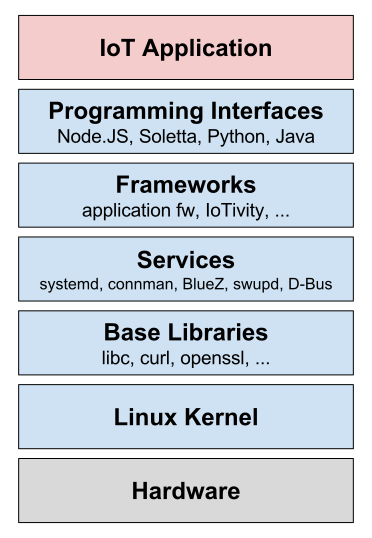

.. _architecture:

Ostro |trade| OS Architecture
#############################

Introduction
============

The Ostro |trade| OS is a pre-compiled, configured and secured base
Internet of Things (IoT) Linux\* OS that supports creating custom images
easily. For more information, see :ref:`about_ostro`.

This document gives an overview of the Ostro OS architecture and its main
building blocks. Furthermore, the document briefly talks about how
Ostro OS meets different end-user use-cases ranging from hacking to
IoT product creation.

.. _`Yocto Project`: http://yoctoproject.org
.. _`Soletta Project`: http://solettaproject.org
.. _`Node.JS`: https://nodejs.org
.. _`IoTivity`: https://www.iotivity.org/
.. _`Ostro Project download server`: https://download.ostroproject.org
.. _`application sample recipes`: https://github.com/ostroproject/meta-appfw/tree/master/recipes-appfw
.. _`Open Connectivity Foundation`: http://openconnectivity.org/

Ostro OS Characteristics
========================

In Ostro OS, there are four key characteristics that
drive the architecture design:

#. **Ostro OS uses standard libraries and services**: The building blocks
   used in Ostro OS are commonly used in many open-source projects and custom
   implementations are avoided to the extent possible. This has a big benefit
   as there is little porting or platform adaptation needed to get
   existing applications or services to run on Ostro OS; often times, all that's
   needed is to create a manifest for your application.

#. **Ostro OS is pre-compiled and pre-configured**: Ostro OS leverages the
   `Yocto Project`_ build tools and is provided as a pre-compiled and pre-configured
   distribution specifically tuned for IoT devices. Generating and compiling your own
   Ostro OS image is very fast since the build system is configured to use the Shared
   State Cache (SSTATE) mechanism offered by the Yocto tools [TODO].
   In addition, pre-compiled reference images are available from the
   `Ostro Project download server`_ to get you started in no time.

#. **Ostro OS is built with security in mind**: Security is
   critical for IoT and is a focus area in Ostro OS. The security
   design provides scalable options for security configurations
   in Ostro OS-based products. The security architecture is explained in
   more details in :ref:`system-and-security-architecture`.

#. **Ostro OS is easy to customize**: While Ostro OS comes pre-compiled
   (binaries and images), it can be customized
   to meet the diverse product needs of IoT applications. With the help of
   the Yocto Project build system used by Ostro OS, it is easy to customize
   the build and generated images that are finely tuned to meet your exact needs.
   :ref:`about_ostro` and the links provided there are an excellent starting point
   to learn more about the Ostro OS extensive customization possibilities. These
   pre-compiled images are intended to expedite your development work and not intended
   for use in production systems.

Ostro OS Architecture Stack
===========================

One way to describe Ostro OS architecture is to build a stack from the
hardware platform up to an IoT Application layer. This stack is
illustrated here.

The following sections examine each layer in more details.

IoT Applications
----------------
The IoT applications layer consist of all applications that use the
underlying platform. Ostro OS itself currently does not
implement any specific IoT use-cases via applications, but 
`application sample recipes`_ are provided to demonstrate the OS services.

Programming Interfaces
-----------------------
Ostro OS provides various application runtimes offering more flexibility and
options to application developers to implement their IoT solution.

* `Soletta Project`_ is an open-source
  framework for making IoT applications. The project provides libraries
  to make it quick and easy to write software for IoT devices. The
  applications can we written using flow-based programming (FBP) or
  more traditionally as C applications linking to Soletta's C-based
  platform APIs.

* `Node.JS`_ is a popular JavaScript runtime to
  run (IoT) web applications. Ostro OS provides the Node.JS runtime
  and selected JavaScript APIs (as Node.JS modules) to build IoT
  applications. The set of APIs includes, for example, a Javascript API for
  the `Open Connectivity Foundation`_ (OCF) specifications. The JavaScript
  API set is kept aligned with the API set provided by Soletta.

* Ostro OS also provides support for the popular IoT-space development
  languages Python and Java\* (OpenJDK8).

Frameworks
----------

Frameworks provide an abstraction to platform services, making
application deployment easier. The Ostro Application
Framework :ref:`application-framework` provides tooling for
application writers to get the applications running in an Ostro OS
based image.

The Ostro Application framework implements a systemd generator that
parses the application manifest files to generate a systemd service file.

`IoTivity`_ [TODO]

Services
--------

The responsibility of system services is to bring the system up,
manage connectivity and set up process' inter-process communication (IPC).
The components Ostro OS use are commonly found in many open-source OSes: systemd,
ConnMan, BlueZ, D-Bus and others.

In addition to systemd and connectivity, Ostro OS comes with
:ref:`software-update` technology that helps support software
updates to deployed devices.

Base Libraries
--------------

Standard Linux base libraries are used in Ostro... [TODO]

Linux Kernel and Hardware Adaptation
-------------------------------------

The hardware board support packages (BSP) for Ostro OS run the Linux Kernel. The kernel
provides the necessary drivers and hardware adaptation.

Sensors and connectivity are critical for IoT devices. Therefore,
Ostro OS maintains a dedicated page for :ref:`hardware` that describes
how various peripherals can be run with :ref:`platforms`.

Ostro OS Composition
====================

The Ostro OS is a composition of multiple Yocto Project build system
metadata layers maintained in individual layer repositories. The layers used
in Ostro OS are combined to form the ``ostro-os`` repo.

The following layer repositories are used in Ostro OS. The Board
Support Package (BSP) layers [TODO]

========================= =======================================
Layer Name                Description
========================= =======================================
openembedded-core         Core metadata and major source of
                          all component recipes
meta-appfw                Ostro OS application framework recipes
meta-intel-iot-middleware Middleware components used in Intel IoT
                          DevKit
meta-intel-iot-security   Security building blocks: IMA, SMACK.
meta-iotqa                Ostro OS test tools
meta-iot-web              Layer for Node.JS and some JavaScript
                          APIs
meta-java                 Java support (openjdk8)
meta-oic                  IoTivity
meta-ostro                Ostro OS distro metadata, configuration,
                          and documentation
meta-ostro-bsp            Ostro OS BSP configuration metadata
meta-ostro-fixes          Ostro OS layer that is used to carry
                          fixes to upstream layers
meta-security-isafw       Image Security Analysis framework gives
                          offline tooling to analyze images
meta-soletta              Soletta Project
meta-swupd                Software update tooling
meta-intel                BSP layer for common IA platforms
meta-yocto-bsp            BSP layer for BeagleBone black
meta-edison-bsp           BSP layer for Intel Edison.
========================= =======================================

Ostro OS Development Workflows  
==============================

.. _`Yocto Project SDK`: http://www.yoctoproject.org/docs/2.1/sdk-manual/sdk-manual.html

[TBD]

* eSDK  [Mikko, I bet you can gleen some useful words from the intro of the sdk manual I linked to above]
* swupd feeds
* SSTATE

Ostro OS Technical Documentation
=================================

The following documents give more technical details about specific Ostro
OS components and their usage.

.. toctree::
   :maxdepth: 1

   disk-layout
   efi-boot
   software-update
   application-framework
   security-threat-analysis
   system-and-security-architecture
